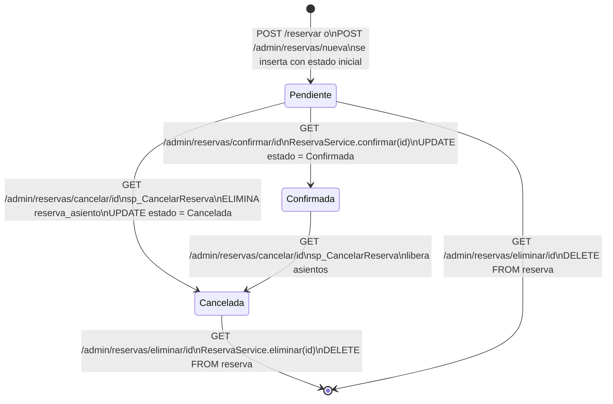
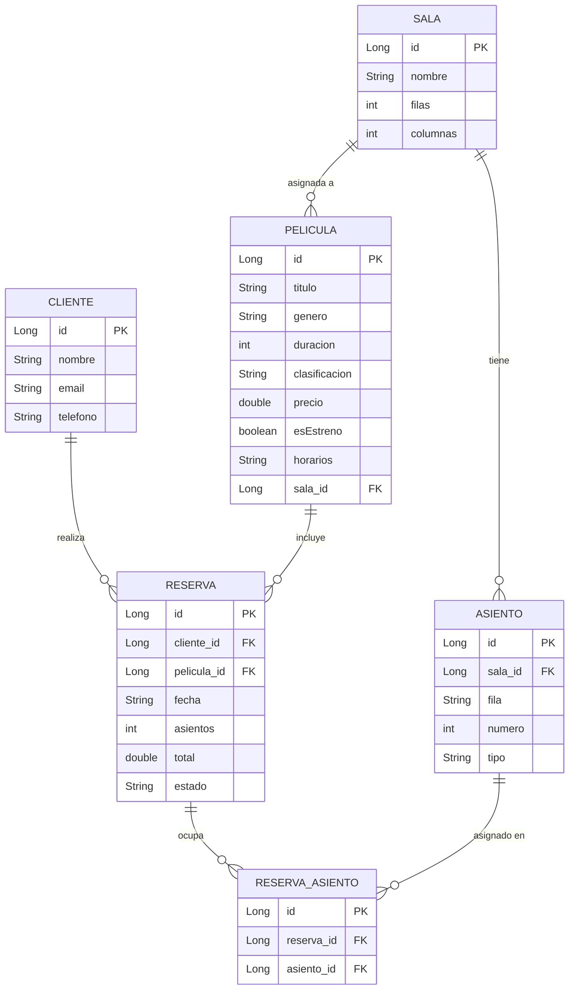
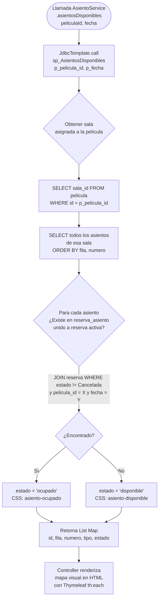
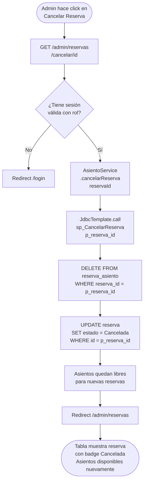
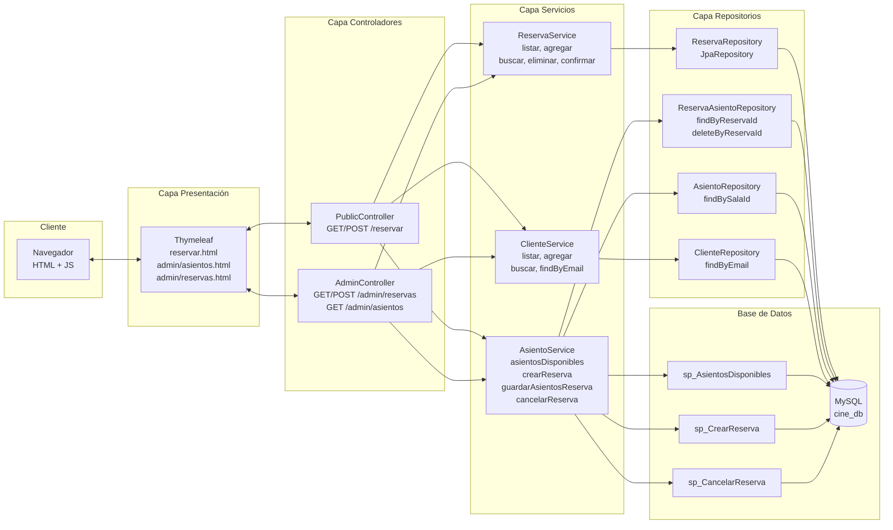
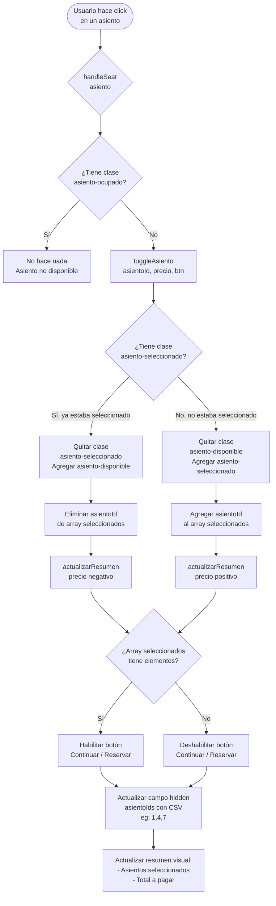

# Diagramas de Flujo - Sistema de Reservas de Asientos
## Cine La Estación — Spring Boot + Thymeleaf

---

## 1. Flujo Público — Reserva desde la Web (Cliente)

```mermaid
flowchart TD
    A([Cliente accede a /reservar]) --> B[GET /reservar\nsin parámetros]
    B --> C[Muestra grid de películas\ndisponibles]
    C --> D{¿Cliente selecciona película?}
    D --> |Sí| E[GET /reservar?peliculaId=X]
    E --> F[Muestra formulario de fecha\ny selector de horarios]
    F --> G{¿Selecciona fecha y horario?}
    G --> |Sí| H[GET /reservar?peliculaId=X\n&fecha=YYYY-MM-DD HH:mm]
    H --> I[AsientoService\n.asientosDisponibles\npeliculaId, fecha]
    I --> J[(sp_AsientosDisponibles\nMySQL Procedure)]
    J --> K{Consulta sala asignada\na la película}
    K --> L[Lista todos los asientos\nde la sala]
    L --> M{¿Existe ReservaAsiento\npara esa función\ncon estado != Cancelada?}
    M --> |Sí| N[Estado = 'ocupado']
    M --> |No| O[Estado = 'disponible']
    N --> P[Retorna mapa de asientos\ncon estados]
    O --> P
    P --> Q[Renderiza mapa visual\nde asientos en reservar.html]
    Q --> R{Cliente selecciona asientos\nen el mapa JS}
    R --> |Click en asiento disponible| S[toggleAsiento: marca seleccionado\ncss: asiento-seleccionado]
    S --> T[actualizarResumen:\ncalcula precio total]
    T --> U[Cliente llena datos:\nnombre, apellido, email, teléfono]
    U --> V{¿Envía el formulario?}
    V --> |POST /reservar| W[PublicController\n.procesarReserva]
    W --> X{¿Existe cliente\npor email?}
    X --> |No| Y[ClienteRepository\n.save - crea nuevo cliente]
    X --> |Sí| Z[Usa cliente existente]
    Y --> AA[AsientoService\n.crearReserva]
    Z --> AA
    AA --> AB[(sp_CrearReserva\nMySQL Procedure)]
    AB --> AC[INSERT INTO reserva\nRetorna reservaId]
    AC --> AD[AsientoService\n.guardarAsientosReserva\nreservaId, asientoIds]
    AD --> AE[Guarda ReservaAsiento\npor cada asiento seleccionado]
    AE --> AF[Redirect /reservar?exito=true]
    AF --> AG([Muestra mensaje de éxito\nal cliente])
```



---

## 2. Flujo Administrativo — Reserva desde el Panel Admin

```mermaid
flowchart TD
    A([Admin accede a /admin/reservas]) --> B{¿Tiene sesión\nválida?}
    B --> |No| C[Redirect /login]
    B --> |Sí| D[GET /admin/reservas\nListado de reservas]
    D --> E[Admin completa formulario:\n- Seleccionar cliente\n- Seleccionar película\n- Fecha y horario\n- Estado: Pendiente/Confirmada]
    E --> F[GET /admin/asientos\n?peliculaId=X&fecha=Y\n&clienteId=Z&estado=Pendiente]
    F --> G[AdminController\n.mostrarAsientos]
    G --> H[AsientoService\n.asientosDisponibles\npeliculaId, fecha]
    H --> I[(sp_AsientosDisponibles\nMySQL Procedure)]
    I --> J[Retorna mapa de asientos\ncon estado disponible/ocupado]
    J --> K[Renderiza admin/asientos.html\ncon panel de selección]
    K --> L{Admin selecciona asientos\nen el mapa]
    L --> M[POST /admin/reservas/nueva\ncon asientoIds como CSV]
    M --> N[parsearIds: convierte\nCSV a List de Long]
    N --> O[AsientoService\n.crearReserva]
    O --> P[(sp_CrearReserva\nMySQL Procedure)]
    P --> Q[INSERT INTO reserva\nRetorna reservaId]
    Q --> R[AsientoService\n.guardarAsientosReserva]
    R --> S[INSERT INTO reserva_asiento\npor cada asiento]
    S --> T[Redirect /admin/reservas]
    T --> U[Muestra tabla actualizada\nde reservas]
```

---

## 3. Ciclo de Vida de una Reserva — Estados



---

## 4. Diagrama de Entidades — Modelo de Datos



---

## 5. Flujo de Consulta de Disponibilidad — Procedimiento sp_AsientosDisponibles



---

## 6. Flujo de Cancelación — sp_CancelarReserva



---

## 7. Arquitectura de Capas — Flujo de una Solicitud



---

## 8. Selección de Asientos — Lógica JavaScript en el Frontend



---

## Notas Técnicas

| Componente | Tecnología | Detalle |
|---|---|---|
| Backend | Spring Boot 3.2.5 | Java, MVC, JPA/Hibernate |
| Base de Datos | MySQL (cine_db) | Procedimientos almacenados para operaciones críticas |
| Frontend | Thymeleaf + Bootstrap 5 | Renderizado server-side |
| Lógica JS | Vanilla JavaScript | Selección de asientos en cliente |
| Acceso a BD | JdbcTemplate + JPA | AsientoService usa JDBC para SP; demás usan JPA |
| Roles | ADMIN / CAJERO | Validados por HttpSession (hardcoded en LoginController) |
